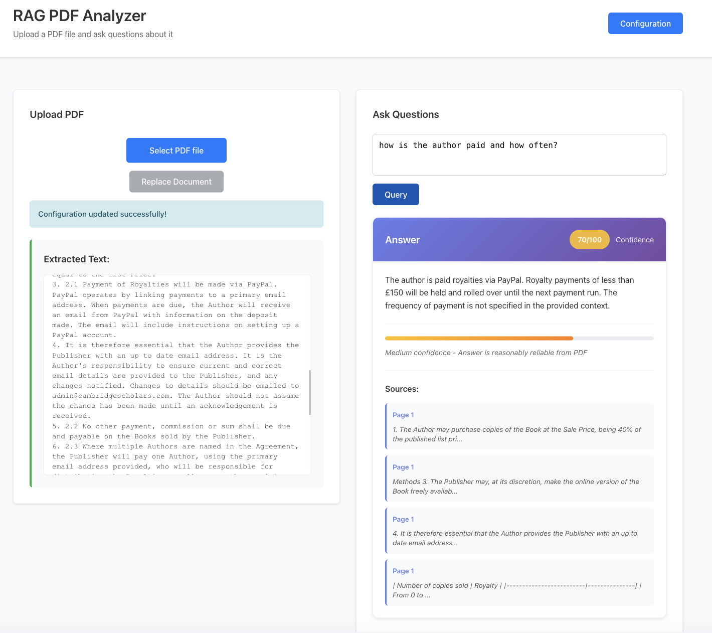
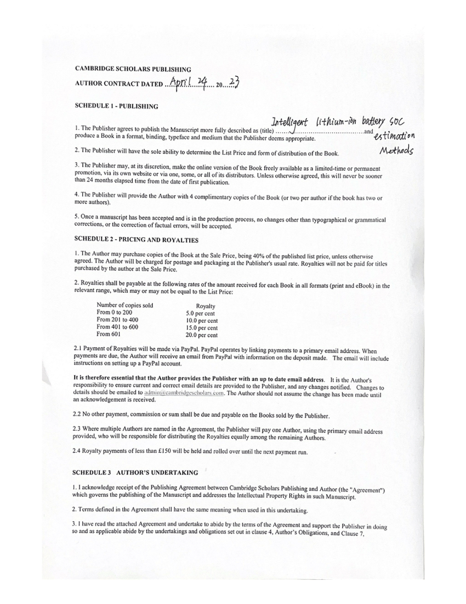

# RAG PDF Analyzer

Upload a PDF file and ask questions about it using Retrieval-Augmented Generation (RAG). Built with FastAPI backend and React frontend.

<div style="display: flex; gap: 20px;">
  
  
</div>

## Features

- **PDF Upload**: Upload PDF documents for processing
- **AI-Powered Q&A**: Ask questions about your documents using OpenAI
- **RAG Technology**: Uses FAISS vector store for efficient document retrieval
- **Configurable RAG Parameters**: Customize chunk size, chunk overlap, temperature, and model selection for optimal performance
- **Confidence Scoring**: Each answer includes a confidence score (1-100) indicating the reliability of the response
- **Source Attribution**: View detailed source information for each answer, including page numbers, section names, and text previews from the PDF

## Architecture

- **Backend**: FastAPI with LangChain for RAG pipeline
- **Vector Store**: FAISS (in-memory, session-based) via LangChain Community
- **AI Models**: OpenAI Embeddings + ChatOpenAI (via LangChain OpenAI)
- **Frontend**: React with Vite
- **PDF Processing**: Docling for local PDF extraction with OCR and table structure recognition

### LangChain Components

The application uses several LangChain libraries for the RAG pipeline:

- **LangChain Core**: PromptTemplate, RunnablePassthrough, StrOutputParser for orchestrating the RAG chain
- **LangChain OpenAI**: OpenAIEmbeddings and ChatOpenAI for embeddings and LLM interactions
- **LangChain Community**: FAISS vector store integration
- **LangChain Text Splitters**: RecursiveCharacterTextSplitter for document chunking

## Prerequisites

- Python 3.8+
- Node.js 16+
- OpenAI API key


## Setup Instructions

### Quick Start (Recommended)

Use the provided run script for automatic setup:

```bash
./run.sh
```

This script will:
- Create a Python virtual environment
- Install all dependencies
- Start both backend and frontend servers

### Manual Setup

#### 1. Setup Backend with Virtual Environment

```bash
# Create virtual environment
cd backend
python3 -m venv venv

# Activate virtual environment
source venv/bin/activate  # On Windows: venv\Scripts\activate

# Install dependencies
pip install --upgrade pip
pip install -r requirements.txt
```

#### 2. Setup Frontend

```bash
cd frontend
npm install
```

#### 3. Running the Application

**Option A: Using the run script (easiest)**
```bash
./run.sh
```

**Option B: Manual startup**

Start the Backend Server:
```bash
cd backend
source venv/bin/activate  # Activate virtual environment
python main.py
```

Start the Frontend Development Server (in another terminal):
```bash
cd frontend
npm run dev
```

The backend will be available at `http://localhost:8000`  
The frontend will be available at `http://localhost:5173`

**Note**: No environment variable configuration is needed. You will enter your OpenAI API key directly in the application UI when you first access it.

## Usage

1. **Set API Key**: Enter your OpenAI API key
2. **Upload a PDF**: Click "Select PDF file" and choose your documentation, then click "Upload"
3. **Ask Questions**: Type your question in the text area and click "Query"
4. **Get Answers**: The AI will search through your document and provide relevant answers with confidence scores and detailed source information (page numbers, sections, and text previews)

## API Endpoints

- `GET /health` - Health check and document status
- `POST /upload` - Upload and process PDF files
- `POST /query` - Query uploaded documents

## Technical Details

### Configurable RAG Pipeline Parameters

The application provides configurable parameters to customize the RAG pipeline behavior. These can be adjusted through the Configuration button in the header:

- **Chunk Size** (default: 1000, range: 100-5000 characters): Size of text chunks into which documents are split. Larger chunks provide more context per retrieval, while smaller chunks enable more granular and specific retrieval.
- **Chunk Overlap** (default: 200 characters): Number of overlapping characters between consecutive chunks. Helps preserve context at chunk boundaries, ensuring important information isn't lost when splitting.
- **Temperature** (default: 0.0, range: 0.0-2.0): Controls the randomness and creativity of LLM responses. 
  - Lower values (0.0-0.3): More deterministic and consistent answers, ideal for factual information
  - Medium values (0.4-0.7): Balanced between consistency and creativity
  - Higher values (0.8-2.0): More creative and varied responses, may include more interpretation
- **Model Name** (default: gpt-3.5-turbo): The OpenAI model used for generating responses. Available options:
  - `gpt-3.5-turbo`: Faster and more cost-effective, suitable for most use cases
  - `gpt-4`: More capable and accurate, better for complex questions
  - `gpt-4-turbo`: Enhanced version of GPT-4 with improved performance

### Confidence Scoring

Each answer generated by the RAG system includes a confidence score from 1 to 100, which indicates the reliability of the response:

- **High Confidence (80-100)**: Answer is very reliable, based on strong matches in the document
- **Medium Confidence (60-79)**: Answer is reasonably reliable, with good document support
- **Low Confidence (40-59)**: Answer may be incomplete or uncertain, limited document support
- **Very Low Confidence (1-39)**: Answer is unreliable or insufficient, minimal document support

The confidence score is calculated based on:
- Number of relevant document chunks retrieved
- Completeness of the answer
- Alignment between the question and answer

### Source Attribution

Every answer includes detailed source information that shows exactly where the information came from in your PDF:

- **Page Numbers**: The specific page(s) in the PDF where the relevant content was found
- **Section Names**: Section headings or titles where the information appears (when detected)
- **Text Previews**: Snippet previews (first 100 characters) of the actual text chunks used to generate the answer

This transparency allows you to:
- Verify the accuracy of answers by checking the source material
- Understand which parts of your document are most relevant to your question
- Navigate directly to the relevant sections in your PDF for further reading

### Document Processing
- **PDF Extraction**: Powered by Docling, which provides:
  - Local processing (no API calls needed for PDF extraction)
  - OCR support for scanned documents
  - Table structure recognition
  - Accurate page number tracking
  - Markdown export preserving document structure (headers, tables, etc.)
- Documents are split into configurable chunks (default: 1000 characters) with overlap (default: 200 characters)
- Uses LangChain's RecursiveCharacterTextSplitter for optimal text segmentation
- FAISS vector store (via LangChain Community) enables fast similarity search

### RAG Pipeline
1. **PDF Text Extraction**: Using Docling to extract text, preserving document structure including headers, tables, and layouts. Supports OCR for scanned documents and accurate page tracking.
2. Text chunking with LangChain's RecursiveCharacterTextSplitter using configurable chunk size and overlap
3. OpenAI embeddings generation (via LangChain OpenAI) for each chunk
4. FAISS index creation (via LangChain Community) for efficient retrieval
5. Context-aware prompt construction using LangChain PromptTemplate
6. OpenAI LLM response generation using LangChain ChatOpenAI with configurable temperature
7. Response processing through LangChain's RunnablePassthrough and StrOutputParser


## Limitations

- Documents are stored in-memory (cleared on server restart)
- Single session processing (no persistent storage)
- Requires OpenAI API key for embeddings and LLM
- Internet connection required for OpenAI API calls
